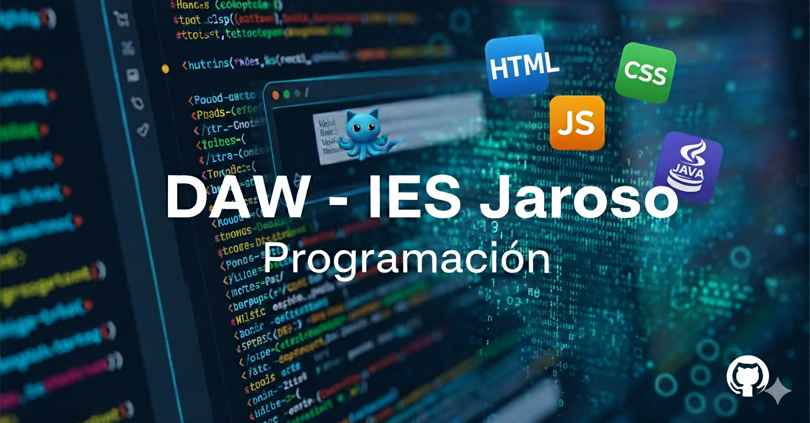

# Programación - Presentación

Programación. Presentación. 1DAW. Curso 2025/2026.

- [Programación - Presentación](#programación---presentación)
  - [Contenidos](#contenidos)
  - [Resultados de aprendizaje](#resultados-de-aprendizaje)
    - [Evaluación](#evaluación)
  - [Autor](#autor)
    - [Contacto](#contacto)
  - [Licencia de uso](#licencia-de-uso)

## Contenidos

1. [Introducción a la programación de software](https://github.com/jjguillen/programacion_2025-2026)
2. [Programación Estructurada y Modular](https://github.com/jjguillen/programacion_2025-2026)
3. [Aplicación de las estructuras de almacenamiento](https://github.com/jjguillen/programacion_2025-2026)
4. [Programación Orientada a Objetos](https://github.com/jjguillen/programacion_2025-2026)
5. [Programación Avanzada Orientada a Objetos](https://github.com/jjguillen/programacion_2025-2026)
6. [Programación Funcional, Genérica y Colecciones](https://github.com/jjguillen/programacion_2025-2026)
7. [Lectura y escritura de información externa. Ficheros](https://github.com/jjguillen/programacion_2025-2026)
8. [Programación con Bases de Datos](https://github.com/jjguillen/programacion_2025-2026)
9. [Programación Interactiva  e Interfaces Gráficas de Usuario](https://github.com/jjguillen/programacion_2025-2026)
10. Proyecto Aplicado

El índice y contenidos puede variar a lo largo del curso para adaptarse al proceso de enseñanza-aprendizaje.

## Resultados de aprendizaje

De acuerdo al [Real Decreto 686/2010](https://www.boe.es/boe/dias/2010/06/12/pdfs/BOE-A-2010-9269.pdf), de 20 de mayo de 2010, y actualizado en el [Real Decreto. 405/2023](https://www.boe.es/boe/dias/2023/06/03/pdfs/BOE-A-2023-13221.pdf), de 29 de mayo de 2023 por el que se establece el título de
Técnico Superior en Desarrollo de Aplicaciones Web y se fijan sus
enseñanzas mínimas, los resultados de aprendizaje son:

1. Reconoce la estructura de un programa informático.
2. Escribe y prueba programas sencillos.
3. Escribe y depura código, analizando y utilizando las estructuras de control del lenguaje.
4. Desarrolla programas organizados en clases.
5. Realiza operaciones de entrada y salida de información.
6. Escribe programas que manipulen información.
7. Desarrolla programas aplicando características avanzadas de los lenguajes orientados a objetos.
8. Utiliza bases de datos orientadas a objetos.
9. Gestiona información almacenada en bases de datos relacionales.

### Evaluación

- Cada RA se evaluará independientemente de los demás, obteniéndose una calificación numérica de 0 a 10.

- Para que un RA sea considerado superado, el alumno deberá tener una calificación en dicho RA promedio >= 5 en base a los instrumentos indicados en la programación didáctica teniendo en cuenta los Criterios de Evaluación asociados.

***El alumnado deberá aprobar todos y cada uno de los RRAA, es decir, tener una calificación mínima de 5 en cada uno de los RRAA. De lo contrario, tendrá una nota en la evaluación inferior a 5.***

## Autor

Codificado por [Javier Guillén](https://github.com/jjguillen)

### Contacto

  Cualquier cosa que necesites házmelo saber por si puedo ayudarte 💬.

 <a href="mailto:jguiben709@g.educaand.es" target="_blank">
        jguiben709@g.educaand.es
    </a>

## Licencia de uso

Este repositorio y todo su contenido está licenciado bajo licencia **Creative Commons** Por favor si compartes, usas o modificas este proyecto cita a su autor, y usa las mismas condiciones para su uso docente, formativo o educativo y no comercial.

<a href="https://creativecommons.org">Apuntes DAW</a> © 2026 by <a href="https://creativecommons.org">Javier Guillén</a> is licensed under <a href="https://creativecommons.org/licenses/by/4.0/">CC BY 4.0</a>

